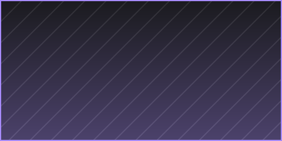

+++
title = "Example One"
date = 2026-09-11
weight = 1
description = "One line about this project."
[extra]
banner = "cover.png"
hide_banner = true
+++

Project details go here. `cover.png` is a placeholder — replace it with your own screenshot:

## What it is

- One-line pitch
- Tech stack
- Status (wip / done / archived)

## Links

- Repo: <!-- 换成你的仓库地址 -->
