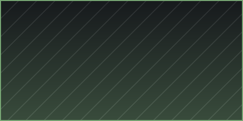

+++
title = "Example Two"
date = 2026-09-05
weight = 2
description = "Second sample, to show weight ordering."
[extra]
banner = "cover.png"
hide_banner = true
+++

Detail page of the second project. The list is sorted by ascending `weight`,
so this one comes after Example One.

